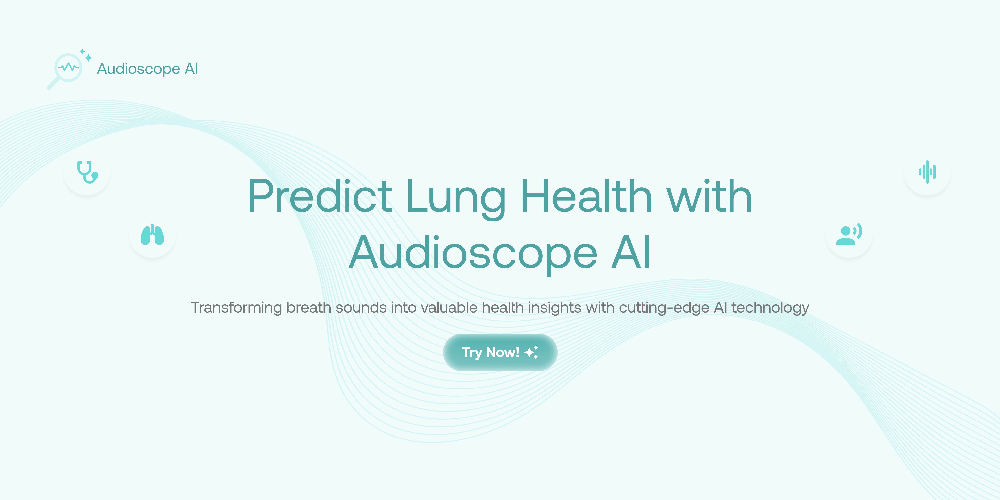

# `audioscopeAI`

<!-- **AI-Powered Respiratory Disease Detection Platform** -->


Audioscope AI is a web-based platform that leverages advanced machine learning and large language models (LLMs) to analyze respiratory sounds and detect potential lung diseases. Using AI-powered audio analysis, the platform provides instant health insights and professional recommendations from simple breathing or cough recordings.


## 👥 Team

| **Name**                    | **Role**                                   |
| --------------------------- | ------------------------------------------ |
| Muhammad Karov Ardava Barus | Lead, AI/ML Engineer, Full Stack Developer |
| Farrel Ardya Ghalyndra      | Front End Developer, AI/ML Engineer        |
| Casta Garneta               | AI/ML Engineer                             |
| Agni Pulung Tondo Drawino   | AI/ML Engineer                             |
| Amira Nida Nisrina          | AI/ML Engineer                             |

---
---

## 🚀 Features

- **AI-Powered Audio Analysis:** Upload a short breathing or cough recording and get instant predictions for 8+ respiratory conditions.
- **LLM Medical Insights:** Google Gemini LLM integration provides easy-to-understand, actionable medical summaries and recommendations.
- **Modern Web UI:** Responsive, user-friendly interface with real-time progress, confidence visualization, and downloadable reports.
- **Comprehensive Security:** File validation, CORS, and privacy-first design.
- **Seamless Integration:** Frontend and backend communicate via a robust REST API.
- **Extensive Error Handling:** User-friendly error messages and robust backend logging.
- **Open for Extension:** Modular codebase for research, clinical, or educational use.

---

## 🩺 Supported Diseases

- Asthma
- Bronchiectasis
- Bronchiolitis
- COPD (Chronic Obstructive Pulmonary Disease)
- Healthy
- LRTI (Lower Respiratory Tract Infection)
- Pneumonia
- URTI (Upper Respiratory Tract Infection)

---

## 🖥️ How It Works

1. **Upload Audio:** Record or upload a 5-10 second audio clip of your breathing or cough.
2. **AI Analysis:** The backend extracts features and predicts the most likely condition.
3. **LLM Insights:** The system generates a professional, layman-friendly summary and recommendations.
4. **Results:** View probabilities, health metrics, and download a detailed report.

---

## 🏁 Getting Started

### Prerequisites
- Python 3.10+
- Node.js (optional, for alternative frontend serving)
- (Windows) Git Bash or compatible shell

### Quick Start (Recommended)

Use the provided batch script to start both backend and frontend with LLM support:

```bash
./start-servers-with-llm.bat
```
- Backend: http://localhost:5000
- Frontend: http://localhost:8080

### Manual Start

#### 1. Start the Backend
```bash
cd src/audioscope-ai-backend
python -m venv venv
source venv/bin/activate  # On Windows: venv\Scripts\activate
pip install -r requirements.txt
python run.py
```

#### 2. Start the Frontend
```bash
cd src/audioscope-ai-frontend
python -m http.server 8000
```
Or use:
- `npx http-server -p 8000` (Node.js)
- `php -S localhost:8000` (PHP)

#### 3. Access the App
- Main: http://localhost:8000
- Test Interface: http://localhost:8000/test-integration.html

---

## 🔗 API Endpoints

- `GET /api/health` — Health check
- `POST /api/predict` — Upload audio for prediction
- `GET /api/diseases` — List detectable diseases
- `GET /api/pipeline/status` — ML pipeline status

**Example:**
```bash
curl -X POST http://localhost:5000/api/predict -F "audio=@your_audio.wav"
```

---

## 🧑‍💻 Usage

1. Open the frontend in your browser.
2. Click "Start Diagnosis" and upload your audio file.
3. Watch real-time progress and view results.
4. Download a detailed report or start a new analysis.

**Prediction Workflow:**
1. User uploads audio file
2. File validation (type, size)
3. API connectivity check
4. Real-time progress display
5. AI prediction call
6. Results processing and display
7. Report generation

---

## ⚙️ Configuration

### Environment Variables (Backend)
- `FLASK_ENV` — development | production
- `FLASK_HOST` — default: 127.0.0.1
- `FLASK_PORT` — default: 5000
- `SECRET_KEY` — Flask secret key
- `GEMINI_API_KEY` — Google Gemini API key for LLM
- `ENABLE_LLM` — Enable/disable LLM insights (default: True)
- `MAX_FILE_SIZE` — Max upload size (default: 50MB)

### File Formats & Limits
- Supported: WAV, MP3, M4A, FLAC
- Recommended: WAV
- Max size: 50MB (configurable)
- Duration: 5-10 seconds recommended

---

## 🧪 Testing

### Backend
```bash
cd src/audioscope-ai-backend
pytest test_api.py -v
```

### Frontend Integration
- Use `test-integration.html` for automated checks.
- Manual: Upload files, verify results, download reports.

---

## 🐛 Troubleshooting

- **Cannot connect to prediction service:** Ensure backend is running at http://localhost:5000
- **Invalid file type:** Only .wav, .mp3, .m4a, .flac are accepted
- **Request timeout:** Check file size and backend status
- **LLM/AI insights missing:** Check Gemini API key and ENABLE_LLM
- **Model file missing:** Ensure `respiratory_classifier.pkl` is present in backend directory

Enable debug logging:
```bash
export LOG_LEVEL=DEBUG
python run.py
```

---

## 🤝 Contributing

1. Follow Python PEP 8 and JS best practices
2. Add type annotations and docstrings
3. Write/extend tests for new features
4. Update documentation for API/UI changes


## 📄 License

This project is licensed under the MIT License.

```
MIT License

Copyright (c) 2024 Muhammad Karov Ardava Barus, Farrel Ardya Ghalyndra, Casta Garneta, Agni Pulung Tondo Drawino, Amira Nida Nisrina

Permission is hereby granted, free of charge, to any person obtaining a copy
of this software and associated documentation files (the "Software"), to deal
in the Software without restriction, including without limitation the rights
to use, copy, modify, merge, publish, distribute, sublicense, and/or sell
copies of the Software, and to permit persons to whom the Software is
furnished to do so, subject to the following conditions:

The above copyright notice and this permission notice shall be included in all
copies or substantial portions of the Software.

THE SOFTWARE IS PROVIDED "AS IS", WITHOUT WARRANTY OF ANY KIND, EXPRESS OR
IMPLIED, INCLUDING BUT NOT LIMITED TO THE WARRANTIES OF MERCHANTABILITY,
FITNESS FOR A PARTICULAR PURPOSE AND NONINFRINGEMENT. IN NO EVENT SHALL THE
AUTHORS OR COPYRIGHT HOLDERS BE LIABLE FOR ANY CLAIM, DAMAGES OR OTHER
LIABILITY, WHETHER IN AN ACTION OF CONTRACT, TORT OR OTHERWISE, ARISING FROM,
OUT OF OR IN CONNECTION WITH THE SOFTWARE OR THE USE OR OTHER DEALINGS IN THE
SOFTWARE.
```


